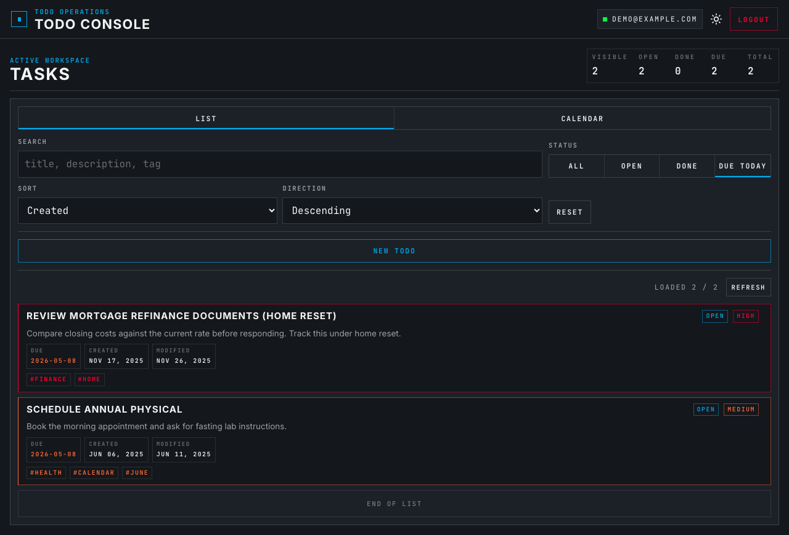
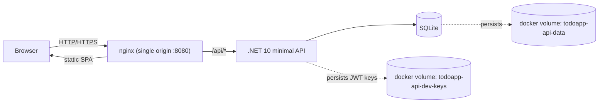

# Todo Console

A production-shaped review app built with an ASP.NET Core minimal API,
EF Core SQLite persistence, and a React/Vite SPA. It covers the core review
flow end to end: register or sign in, manage todos, search/filter/sort/page
them, complete or delete them, and keep each user's data isolated.



## Quick Start

Prerequisite: Docker with Compose v2.

```sh
git clone https://github.com/typettitt/todo-app.git
cd todo-app && docker compose up --build -d
```

Open <http://localhost:8080>.

## Demo Account

> **Sign in with `demo@example.com` / `Demo123!`.** You will land on a workspace
> seeded with ~500 todos so search, filters, sort, pagination, and the calendar
> view all have data on the first click.

## Architecture At A Glance

A single-origin compose stack: nginx serves the SPA and reverse-proxies `/api`
to an ASP.NET Core minimal API backed by SQLite. The HttpOnly JWT cookie is
issued by the API and rides browser requests same-origin, so there is no CORS
boundary in the local review path. See
[`docs/decisions.md`](docs/decisions.md) for the full architecture narrative.

Single-origin compose stack with named volumes for SQLite data and JWT signing keys.



Top-level layout:

- `src/TodoApp.Api/` — ASP.NET Core minimal API, EF Core, auth, todos
- `src/TodoApp.Api.Tests/` — xUnit + `WebApplicationFactory` coverage
- `client/` — React + Vite + TypeScript SPA
- `docs/` — decisions, operations, OpenAPI snapshot, screenshots
- `Dockerfile`, `docker-compose.yml`, `docker-compose.prod.yml` — review
  stacks with production-shaped defaults

## Test Commands

```sh
dotnet test TodoApp.slnx
npm --prefix client test -- --run
npm --prefix client run e2e
```

The Playwright command targets the running compose stack at
`http://localhost:8080`; bring it up with `docker compose up --build` first.

## CI

GitHub Actions runs the full validation suite on every push and PR. The
workflow file:
[`.github/workflows/ci.yml`](.github/workflows/ci.yml).

## Security

- HttpOnly JWT cookie, no `localStorage` or `sessionStorage` for auth material.
- No refresh-token table for this scope; sessions are server-tracked via
  `AuthSession` rows so logout actually invalidates the cookie.
- Per-account login lockout ladder on repeated failures.
- Cross-user todo access resolves as `404`, not `403`, so another user's id
  is not confirmable.
- Default CSP and HSTS posture in the production compose path.

Full security narrative: [`docs/decisions.md`](docs/decisions.md).

## Known Tradeoffs

The app intentionally stops short of password reset, email verification,
durable audit storage, load testing, a multi-browser E2E matrix, refresh-token
rotation, and deployment-specific edge work such as CSP reporting and HSTS
preload. It is single-replica, uses SQLite, and does not include a backup
schedule, observability pipeline, disaster-recovery runbooks, or SLOs. Full
list with rationale: [`docs/decisions.md`](docs/decisions.md).

## Reset State

```sh
docker compose down -v
```

`down -v` clears all local compose state, including the SQLite database and
dev JWT key.

## Documentation

- [`docs/decisions.md`](docs/decisions.md) — architecture and trade-off narrative
- [`docs/operations.md`](docs/operations.md) — configuration, commands, local
  dev without Docker, production compose, long-form testing/CI
- [`docs/openapi-v1.json`](docs/openapi-v1.json) — captured OpenAPI contract
- [`docs/screenshots/`](docs/screenshots/) — desktop and mobile review
  screenshots
- [`client/README.md`](client/README.md) — SPA-specific commands and notes
