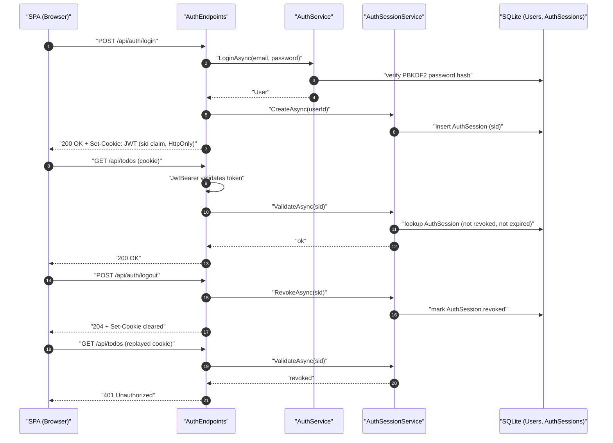
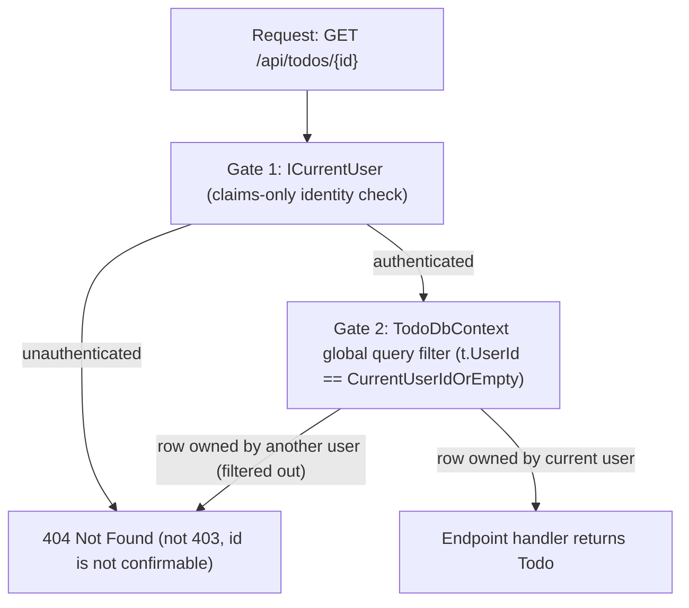
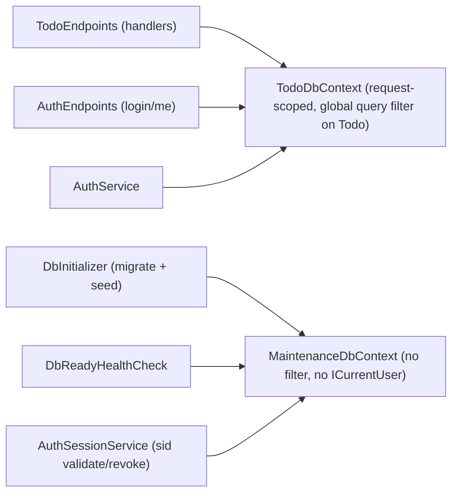

# Decisions And Trade-offs

This document explains the implementation choices behind Todo Console.
It is written for reviewers who want to understand why the app is shaped this
way, where the trade-offs are, and what would come next if the scope expanded.

## Product And Review Goals

The first goal is fast, reliable review. A reviewer should be able to run the
full system with one command, see seeded data, exercise the UI, and reset state
without reading environment setup notes first. That is why `docker-compose.yml`
uses `Development`, applies migrations at startup, creates a demo user, and
stores SQLite plus dev JWT keys in named Docker volumes.

The trade-off is that the default compose file is a review stack, not a
production stack. It publishes the API on loopback for debugging, uses a dev JWT
key volume, and enables Development-only OpenAPI/Scalar endpoints. Production
expectations live in `docker-compose.prod.yml`, where the API is not
host-published and the JWT signing key must come from a mounted secret file.

## Backend Shape

The backend has two projects:

- `src/TodoApp.Api` for the app.
- `src/TodoApp.Api.Tests` for tests.

Within the API project, code is grouped by feature: `Features/Auth`,
`Features/Todos`, `Features/Common`, and `Data`. A separate
Domain/Application/Infrastructure split would add more folders and mapping code
without creating clearer boundaries for this workload.

There is no repository pattern. EF Core `DbContext` is already the unit of work
and query abstraction, and wrapping it would hide important behavior: query
filters, optimistic concurrency, migrations, and ownership scoping. The app uses
small endpoint/query helpers instead of another persistence layer.

## Database And Modeling

SQLite is the default store because it keeps local and Docker setup simple while
still exercising a real relational provider. The app always uses EF migrations;
`EnsureCreated()` is intentionally forbidden by CI because it bypasses migration
history and can desync schema expectations.

Tests use SQLite in-memory rather than EF InMemory. That keeps SQL translation,
indexes, migrations, conversions, uniqueness, and query filters in the test
surface. The trade-off is a slightly heavier test harness, but it catches bugs
that EF InMemory would hide.

`DueDate` is modeled as `DateOnly`. A todo due date is a calendar date, not an
instant in time. The API accepts strict `YYYY-MM-DD` values and rejects datetime
strings so accidental `Date.toISOString()` usage fails loudly.

SQLite has no native date or rowversion types, so the app stores:

- `DateOnly` as ISO `YYYY-MM-DD` text, preserving chronological sort order.
- timestamps as UTC ISO text, preserving chronological sort order.
- `Priority` as text, avoiding silent meaning changes if enum numeric values
  move.
- `Tags` as JSON text with a `ValueComparer`, so EF tracks array content changes.
- `RowVersion` as a `uint` concurrency token incremented by
  `RowVersionInterceptor`.

The row-version interceptor only runs through tracked `SaveChanges` paths.
Bulk `ExecuteUpdate` against todos is forbidden by grep gate because it would
bypass the interceptor.

## Auth And Sessions

Auth uses a short-lived JWT stored in an HttpOnly cookie. The SPA never stores
tokens in `localStorage` or `sessionStorage`, reducing the common XSS token-theft
path. CI also greps auth-sensitive client modules for web storage usage.

Login issues a cookie bound to a server-side `AuthSession` row keyed by `sid`; logout revokes the row before clearing the cookie so replayed cookies fail.



The app does not implement refresh tokens. For this scope, a refresh-token table,
rotation, reuse detection, and revocation UI would add a lot of auth machinery
without changing the core todo review flow. Instead, the app uses a short token
lifetime plus throttled sliding renewal.

Cookie posture by mode:

| Mode | SameSite | Secure | Origin strategy |
| --- | --- | --- | --- |
| Vite dev | `Lax` | `false` | Vite proxies `/api` to `http://localhost:5050`. |
| Local compose | `Lax` | `false` | nginx serves the SPA and proxies `/api` on `http://localhost:8080`. |
| Non-development | `Strict` by default | `true` | Expected behind one HTTPS origin or an explicit reverse proxy. |

Auth rate limiting is per-IP. That is simple and effective enough for a local
take-home app, but production would likely combine per-IP and per-account
limits.

## Ownership And Data Isolation

Todo routes are protected with `RequireAuthorization()`, and EF applies a global
query filter so authenticated users only see their own todos. Endpoint handlers
use filtered lookups for reads, updates, completion, and deletes.

Wrong-user access returns `404`, not `403`. That avoids confirming whether
another user's todo id exists. The trade-off is that clients cannot distinguish
"missing" from "belongs to someone else," which is intentional for this boundary.

Two layered gates run on every authenticated todo request: an identity check via `ICurrentUser`, then a row-scope check via the `TodoDbContext` global query filter.



Production code is not allowed to call `IgnoreQueryFilters()`. Tests cover the
cross-user behavior, and CI enforces the production-code guardrail.

## API Contract And Validation

The API uses minimal endpoints, FluentValidation, normalized ProblemDetails, and
OpenAPI. The client generates TypeScript types from the running Development API,
and CI fails if generated OpenAPI types drift from the checked-in client code.

Enums are serialized and parsed as names, not integers. Numeric enum inputs are
rejected for both JSON bodies and query strings because integer-backed wire
contracts are fragile.

The `DueToday` filter requires the client to send `today=YYYY-MM-DD`. This makes
the filter match the user's local calendar day without requiring a server-side
timezone profile. The trade-off is that the server trusts the date supplied by
the client. A malicious client can ask for a different date, but only within
their own rows.

## Frontend Choices

The SPA uses React, Vite, TypeScript, TanStack Query, React Hook Form, Zod, CSS
modules, and a small set of shared UI components. TanStack Query owns server
state and cache invalidation; React Hook Form and Zod keep form state and
validation close to the fields.

Vite proxies `/api` during local development so browser requests stay
same-origin. That keeps HttpOnly cookie behavior aligned between Vite dev and
the nginx-backed compose stack.

Styling uses CSS modules and tokens instead of Tailwind. For this app size, plain
CSS keeps the rendered UI easy to inspect and avoids bringing in a utility system
that the rest of the repo does not need.

## Containers And Runtime

The API image uses a chiseled ASP.NET runtime pinned by digest. The web image
uses `nginxinc/nginx-unprivileged`, also pinned by digest. CI checks Dockerfile
base image pins so updates are deliberate.

Local compose uses named volumes:

- `todoapp-api-data` for SQLite state.
- `todoapp-api-dev-keys` for Development JWT keys.

This makes reset behavior explicit: `docker compose down -v` removes the review
database and dev signing key.

The production-shaped compose file keeps container filesystems read-only,
drops Linux capabilities, applies `no-new-privileges`, sets PID limits, uses
health checks, and requires the JWT signing key through a secret file. It is
still a compose example, not a full deployment platform.

## Operations Posture

Recent hardening changed the operational posture in a few ways that matter
during deployment and incident response:

- Auth cookies are now backed by `AuthSessions`. The `0004_AddAuthSessions`
  migration intentionally invalidates pre-existing cookies because old JWTs do
  not carry `sid`; users re-login once after the rollout. From that point on,
  logout revokes the server-side session row before clearing the cookie.
- Login abuse controls are stateful per account. Five consecutive failures arm
  the lockout ladder (15m, 1h, 4h, 24h), and a successful login resets the
  ladder. Locked accounts still return the same generic 401, even when the
  supplied password is correct, so account state is not exposed.
- Reverse-proxied production deployments must set `Trust__KnownProxies` to the
  trusted proxy IP/CIDR. `UseForwardedHeaders` runs before auth and rate
  limiting so IP-based auth throttles see the real client, but spoofed forwarded
  headers from untrusted sources are ignored.
- `/health/live` stays public for container liveness. `/health/ready` requires
  `X-Internal-Auth: <Internal__HealthHeader>` outside Development because it
  discloses database readiness.
- Browser-facing CSP and HSTS are owned by nginx. The SPA policy keeps
  `script-src 'self'` with no inline script allowance; HSTS uses
  `max-age=31536000; includeSubDomains` and deliberately omits `preload`.
  API JSON/problem responses get a deny-by-default CSP from middleware.
- Todo read/write rate limits are per authenticated `sub`, while auth
  register/login limits remain per IP. The review compose stack raises the auth
  IP budget for deterministic Playwright runs; production should keep the app
  default unless real traffic data says otherwise.

## Testing And Guardrails

Backend coverage focuses on auth, validation, ownership, todo mutations,
optimistic concurrency, error shapes, logging redaction, health checks, demo
seed gating, and operational guardrails.

Frontend coverage focuses on auth flow, API error handling, todo mutations,
cache behavior, form behavior after validation/conflict responses, keyboard and
label basics, and accessibility smoke checks.

Playwright runs against the Docker compose stack rather than the Vite dev
server. That catches proxy, cookie, routing, and full-stack regressions that unit
tests cannot see.

CI adds repository guardrails for:

- no `EnsureCreated()` in `src`.
- no `IgnoreQueryFilters()` in production code.
- no `AllowAnyOrigin()` paired with credentials.
- no auth tokens in client web storage.
- no todo bulk updates that bypass row-version stamping.
- no inline NuGet versions outside centralized package management.
- Docker base images pinned by digest.
- no hex color literals outside token/global CSS locations.

## Known Limits

- `DueToday` trusts a client-supplied local date.
- Deletes are hard deletes; there is no `DeletedAt`, restore flow, or retention
  policy.
- There is no email verification, password reset, or real email delivery.
- Audit logs go to stdout; they are not persisted to a durable audit store.
- Auth rate limiting is still per-IP, with per-account lockout layered on top;
  todo read/write rate limits are per authenticated user. There is no
  distributed rate-limit store.
- E2E coverage is a Chromium smoke, not a full browser/device matrix.
- There is no load test, chaos test, or OpenTelemetry pipeline. CSP/HSTS exists
  in the compose nginx config, but CDN/edge-specific reporting and preload
  decisions are deployment work.

## What We Would Add Next

If persistence requirements grew, the first likely change would be PostgreSQL.
The service registration would become:

```csharp
services.AddDbContext<TodoDbContext>((sp, opts) =>
{
    opts.UseNpgsql(configuration.GetConnectionString("Default"));
    opts.AddInterceptors(sp.GetRequiredService<RowVersionInterceptor>());
});
```

Then the provider package, connection string, migrations, and any SQLite-specific
conversions would be revisited together.

The remainder of this section groups the next likely deltas by area. Each entry
is something we would add or change if the scope expanded; nothing here is
a known correctness bug in the shipped code.

### Auth

- Surface session inventory in the account UI so users can see their active
  sessions and revoke individual ones. Today logout revokes only the current
  session and the bulk-revoke path is server-internal.
- Refresh-token rotation with reuse detection and a real session-revocation
  view. The current short-lived JWT plus throttled sliding renewal is
  intentional for the review scope, but a longer-lived production deployment
  would want token rotation and an admin-visible revocation surface.
- Email verification, password reset, and real email delivery through a
  transactional provider. The current build deliberately does not ship a
  half-built reset flow; the full flow comes with the email-provider work.

### Data model

- `DeletedAt` soft deletes with filtered indexes and a restore path. Deletes
  today are hard; a soft-delete column would unlock restore and short-window
  retention without changing the read path's filtered behavior.
- Optional move from SQLite to PostgreSQL once persistence requirements grow
  past the review-stack profile, with the provider/connection-string and
  SQLite-specific conversion details revisited together.

### UX

- Broader keyboard / pointer affordances on bulk operations (multi-select,
  bulk complete, bulk delete) once the per-row interactions are settled.
  The current single-row interactions are deliberate and cover the review
  flow.

### Testing

- Cross-machine fresh-clone smoke run on a secondary machine. The harness
  and the documented one-command path are in place; only the second-machine
  execution is pending.
- Broader Playwright browser/device coverage. Today's E2E is a Chromium
  smoke plus the multi-user `@security` isolation suite; a real product
  would extend this to the supported browser/device matrix.
- Load test, chaos test, and a contract-fuzz pass against the OpenAPI
  snapshot. Useful before any real traffic is pointed at the stack.

### Ops

- OpenTelemetry traces and metrics, plus a durable audit-log sink. Stdout
  is fine for review; production-scale incident response wants a queryable
  store and trace correlation across the proxy/API/DB hops.
- A distributed rate-limit store. The current per-process limiter is
  enough for one API replica; a multi-replica deployment needs a shared
  store so the per-IP and per-`sub` budgets are global.
- CSP reporting / report-only rollout, and an explicit HSTS preload
  decision for a real production domain. The compose nginx config carries
  a deny-by-default policy and `max-age` HSTS, but preload and report-uri
  decisions are deployment-specific work.
- LICENSE selection (or an explicit "no license granted" note), tracked
  in the Phase A repo-hygiene follow-ups.

### Docs

- A short post-deploy operator runbook that pairs the existing
  decisions / operations docs with the deployment-specific concerns above
  (rate-limit store, HSTS preload, audit sink). The current docs cover
  the review path end to end; the runbook is the last layer of work.

## Error envelopes + readiness lockdown

- **Endpoint 401/404 responses use the same ProblemDetails envelope as every
  other API error.** Todo missing/wrong-owner lookups and stale `/api/auth/me`
  identities now route through `ProblemDetailsExtensions.NotFoundProblem` /
  `UnauthorizedProblem`, preserving the canonical `{ type, title, status,
  instance, traceId }` shape. CI and backend tests grep production feature code
  for bare `Results.NotFound()` / `Results.Unauthorized()` so future endpoints
  do not regress to empty bodies.
- **Readiness is no longer a public DB-state oracle outside Development.**
  `/health/live` remains anonymous because container liveness should not depend
  on a secret. `/health/ready` still checks the database, but non-Development
  callers must send `X-Internal-Auth` with the exact `Internal:HealthHeader`
  configured for the deployment. Missing configuration outside Development
  fails closed with a 401 ProblemDetails; local review compose remains
  zero-env because it runs the API in Development.
- **The header comparison is constant-time for equal-length values.** This is
  minor for a health probe, but it keeps the internal secret handling aligned
  with the rest of the auth boundary: no body-shape oracle, no timing shortcut,
  no accidental leak in logs.

## Transport hardening

- **No inline theme bootstrap.** The first-paint theme bootstrap now lives in
  `client/src/fouc.ts` and is imported before the rest of `main.tsx`. That keeps
  the dark/light class flip early enough to avoid visible flash, while allowing
  CSP to keep `script-src 'self'` with no inline script allowance. The fallback
  external script path was not needed because the FOUC Playwright spec passes in
  both light and dark modes.
- **SPA CSP and HSTS live at nginx.** The review stack serves the SPA through
  nginx, so `client/nginx.conf` owns the browser-facing policy:
  `default-src 'self'; script-src 'self'; style-src 'self'; img-src 'self'
  data:; font-src 'self' data:; connect-src 'self'; object-src 'none';
  frame-src 'none'; worker-src 'self'; manifest-src 'self'; form-action 'self';
  frame-ancestors 'none'; base-uri 'none'`. `font-src` is explicit because the
  production font assets are real font requests and the first CSP browser run
  caught them being blocked. HSTS uses `max-age=31536000; includeSubDomains`
  without `preload` because preload should be a deliberate deployment decision,
  not a default in a take-home stack.
- **API JSON responses get a deny-by-default CSP.** The API middleware adds
  `Content-Security-Policy: default-src 'none'; object-src 'none';
  frame-ancestors 'none'; base-uri 'none'; form-action 'none'` plus
  `Permissions-Policy: camera=(), microphone=(), geolocation=()`. It skips CSP
  for `text/html` so Development Scalar/OpenAPI
  pages remain usable.
- **Review-stack auth limiter override.** The API default auth limit remains
  10/min/IP, but `RateLimits:Auth:PermitLimit` is configurable and the local/CI
  compose stack sets it to 100. Full Playwright creates isolated users quickly;
  letting the review stack raise that budget keeps e2e deterministic without
  weakening the app default.
- **Playwright launcher strips color-env conflict.** The npm e2e scripts call
  `client/scripts/run-playwright.mjs`, which removes inherited `NO_COLOR` before
  spawning Playwright. That avoids the otherwise noisy `NO_COLOR`/`FORCE_COLOR`
  warning in local runs and CI logs.

## Auth response equalization + per-account lockout

- **Register oracle elimination.** `POST /api/auth/register` returns the SAME
  body — `{ "status": "received" }` with HTTP 200 — for both branches:
  - new email → account is created, an auth session is opened, an auth cookie
    is set on the response;
  - duplicate email → no account is created, no cookie is issued, but the body
    and status are byte-identical to the success branch.
  A network-position attacker with TLS in the way cannot tell the two apart
  from the response shape alone. The frontend learns the real outcome by
  refetching `/api/auth/me` immediately after the register call: if the cookie
  was issued, `/me` returns the user and the SPA navigates to the dashboard;
  if the cookie was not issued, `/me` 401s and the SPA shows a generic
  acknowledgement message ("Registration request received…"). The
  asymmetry — cookie present vs absent — is invisible to a passive observer
  but visible to the same-origin SPA, which is exactly the right side of the
  trust boundary.
- **Login timing equalization.** `AuthService.LoginAsync` runs the same PBKDF2
  verify on both branches:
  - user not found → run `IPasswordHasher<User>.VerifyHashedPassword` against
    a lazily-built dummy user + dummy hash, discard the result, throw
    `InvalidCredentialsException`;
  - user found, wrong password → run the real verify and throw the same
    exception.
  Without this, the miss path is observably faster than the wrong-password
  path because PBKDF2 is the dominant cost of the login flow, and an attacker
  can enumerate accounts via response time even when the response body is
  identical. The dummy hash is built lazily through the registered hasher so
  it always matches the active KDF cost — hardcoding bytes would skip the
  iteration count and re-open the gap.
- **Per-account lockout ladder (15m / 1h / 4h / 24h, clamped at 24h).** The
  `Users` table carries `FailedLoginCount`, `LockoutUntil`, and
  `LockoutLadderStep`. Five consecutive failed login attempts arms the
  current ladder step; the next 5 fails arm the step above; clamped at 24h
  on the fifth burst and beyond. A successful login zeroes all three so an
  honest user who fat-fingers a password four times does not carry that
  state forever. While locked, login ALWAYS returns the generic 401 — even
  the CORRECT password returns the same body during lockout, which removes
  the "you got it right but the account is locked" oracle. This is
  counter-intuitive but load-bearing; do not "fix" it. The lockout ladder
  decisions live in `AuthService.LoginAsync` and the migration
  `0005_AddUserLockoutState` adds the columns; rate-limiting on
  `/api/auth/register` and `/api/auth/login` (10/min/IP) stays in place
  alongside the lockout — they are complementary defenses (per-IP burst
  control vs per-account walking lockout) and both are needed.

## Auth sessions + invalidate-on-deploy

- Every issued auth cookie is bound to an `AuthSession` row keyed by a `Sid`
  (Guid). The JWT carries `sid` as a claim; the JwtBearer `OnTokenValidated`
  event resolves the claim against `AuthSessionService.ValidateAsync`. Tokens
  whose `sid` is missing, malformed, revoked, or whose `ExpiresAt` /
  `AbsoluteExpiresAt` has passed are rejected with a clean 401 ProblemDetails.
- `POST /api/auth/logout` revokes the row before clearing the cookie. A
  captured pre-logout cookie replayed afterwards fails on the server even
  though the JWT signature is still valid. JWT validity is necessary but not
  sufficient.
- Sliding renewal extends `AuthSession.ExpiresAt` up to (never past)
  `AbsoluteExpiresAt` (7 days from creation). If the row is already revoked
  or past the absolute cap, the renewal middleware does not issue a new
  cookie — the next request 401s.
- `AuthSessionService` resolves `MaintenanceDbContext`, not `TodoDbContext`,
  because sessions cross users: the validator must read whatever `sid` an
  inbound cookie carries, and the request-scoped row filter on `TodoDbContext`
  would hide other users' sessions.
- **Invalidate-on-deploy is intentional.** The migration `0004_AddAuthSessions`
  creates the `AuthSessions` table empty. Every JWT in the wild before this
  ships lacks a `sid` claim, so the validator rejects it on the first
  authenticated request. **All users are forced to log in again exactly once
  after this deploys** — there is no migration path that retro-mints sessions
  for legacy cookies, and that is the whole point: it is the moment when the
  pre-Phase-3 cookies stop working. Clients on `/api/auth/me` simply see a
  401 and re-render their login screen.

## Maintenance vs Request DbContexts

`TodoDbContext` is request-scoped and filtered; `MaintenanceDbContext` is unfiltered and used by anything that crosses users or runs outside an HTTP request.



- `TodoDbContext` is the request-scoped context. Its `Todo` global query filter
  is `t.UserId == CurrentUserIdOrEmpty()`. When `ICurrentUser.IsAuthenticated ==
  false`, the helper returns `Guid.Empty` and no row matches — fail-CLOSED.
  (Previously the filter had a `!IsAuthenticated || …` short-circuit that fell
  open and exposed every user's rows on anonymous reads.)
- `MaintenanceDbContext` is the non-request context with NO filter and NO
  `ICurrentUser` dependency. Used for: EF migrations at startup, dev seeding,
  the `/health/ready` DB check, and `dotnet ef` design-time tooling. Anything
  in an HTTP request path uses `TodoDbContext`.
- EF migrations are typed against `MaintenanceDbContext` (the
  `[DbContext(typeof(MaintenanceDbContext))]` attribute on the migration
  designer/snapshot files). Schema is the same; only the runtime row filter
  differs between the two contexts.
- `FailClosedFilterTests` enforces both halves of the boundary structurally:
  anonymous reads through `TodoDbContext` return empty, and reads through
  `MaintenanceDbContext` return every row.

## Forwarded headers + trusted proxies

- The rate limiter partitions by `RemoteIpAddress`. Behind a reverse proxy, that
  defaults to the docker bridge IP, allowing one infinite bucket for all internet
  traffic. We call `app.UseForwardedHeaders()` before `app.UseRateLimiter()` and
  trust only proxies declared via `Trust:KnownProxies`.
- Default config trusts loopback only (Dev convenience). In production set
  `Trust__KnownProxies` to the nginx container IP/CIDR. Spoofing tests in
  `ForwardedHeadersTests` assert that `X-Forwarded-For` from an untrusted source
  is ignored.
- `ForwardLimit = 1` — we only have one proxy hop (nginx → API). If you stack a
  CDN, raise this and add the CDN's egress range to `Trust:KnownProxies`.

## User-scoped private cache keys

- TanStack Query keys for any private (per-user) data are namespaced under
  `['private', userId, ...]`. The `todosKeys` factory takes `userId` as its
  first argument; every call site threads `useMe().data?.id` through.
- Auth boundaries (logout, login success, register success, 401 in
  `RequireAuth`) call `clearPrivateData(queryClient)` which cancels then
  removes every query under `['private']`. Without this, an Alice→Bob switch
  in the same SPA session paints Bob's first frame with Alice's cached rows
  before Bob's `/me` and `/api/todos` refetch land. The new namespace makes
  the boundary clear a one-line `removeQueries` call instead of an ad-hoc
  walk over each todo key.
- `apiRequest` reads `response.status` BEFORE attempting `ProblemDetailsSchema`
  parsing and uses `safeParse` with a synthesized fallback. This keeps the 401
  boundary working when the body is HTML or empty (nginx, Cloudflare, etc.) —
  a strict zod parse would have thrown a `ZodError` past `handleUnauthorized`.
- `NormalizeEmail` applies `Normalize(NormalizationForm.FormC)` BEFORE
  `ToLowerInvariant` so combining-vs-precomposed accent forms collapse to the
  same record key. Without NFC the same human-visible address can register
  two separate accounts; `UnicodeEmailFixtureTests` pins this.
